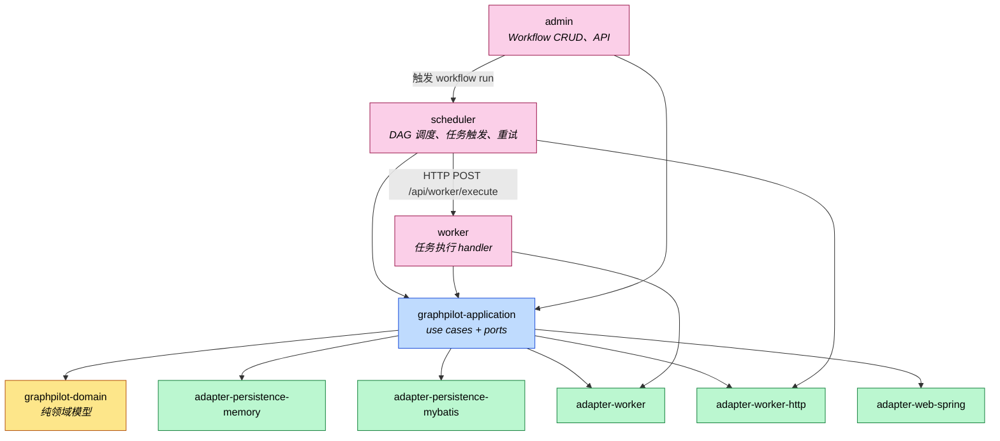

# GraphPilot 模块依赖图

本文档描述 GraphPilot 后端 Maven 多模块之间的依赖关系。后端采用 **3 核心业务模块** 架构：

```text
scheduler (调度) → worker (执行) → admin (管理 API)
```

> 图中箭头方向 `A --> B` 表示 **A 依赖 B**。

## 模块依赖图



## 新架构：3 核心模块

| 模块 | 端口 | 职责 |
|------|------|------|
| **scheduler** | 8080 | DAG 调度、依赖解析、任务触发、重试、PENDING 扫描补偿 |
| **worker** | 8081 | 任务执行（shell/mock handlers），接收 HTTP 请求 |
| **admin** | 8082 | Workflow CRUD、WorkflowRun 创建与查询、前端 API |

## 依赖矩阵

| 模块 | 依赖的内部模块 |
|------|----------------|
| `graphpilot-domain` | （无） |
| `graphpilot-application` | `graphpilot-domain` |
| `adapter-persistence-memory` | `graphpilot-application` |
| `adapter-persistence-mybatis` | `graphpilot-application` |
| `adapter-worker` | `graphpilot-application` |
| `adapter-worker-http` | `graphpilot-application`、`adapter-worker` |
| `adapter-web-spring` | `graphpilot-application` |
| **scheduler** | `graphpilot-application`、`graphpilot-domain`、`adapter-persistence-*`、`adapter-worker`、`adapter-worker-http`、`adapter-worker-spring` |
| **worker** | `adapter-worker`、`adapter-worker-http` |
| **admin** | `graphpilot-application`、`graphpilot-domain`、`adapter-persistence-*`、`adapter-web-spring` |

## 进程间通信

```
┌─────────────┐     POST /api/worker/execute     ┌─────────────┐
│  scheduler  │ ──────────────────────────────────→│   worker    │
│   (8080)    │                                   │   (8081)    │
└─────────────┘                                   └─────────────┘
       ↑
       │ HTTP
       │
┌─────────────┐
│   admin     │
│   (8082)    │
└─────────────┘
```

- **admin → scheduler**：HTTP POST 创建 WorkflowRun（触发调度）
- **scheduler → worker**：HTTP POST 分发任务执行（remote 模式）

## 配置

### scheduler (application.yml)

```yaml
server:
  port: 8080
graphpilot:
  scheduler:
    scanner:
      enabled: true
      interval-ms: 10000
  worker:
    dispatch:
      mode: local  # local 或 remote
```

### worker (application.yml)

```yaml
server:
  port: 8081
graphpilot:
  worker:
    handlers: [shell, mock]
```

### admin (application.yml)

```yaml
server:
  port: 8082
graphpilot:
  persistence:
    type: memory  # memory 或 mybatis
```

## 遗留模块（待废弃）

以下模块保留用于向后兼容，逐步迁移后删除：

- `graphpilot-bootstrap-spring`：原 All-in-one Spring 启动入口
- `graphpilot-bootstrap-micronaut`：原 Micronaut 启动入口
- `graphpilot-adapter-worker-spring`：Spring 事件监听器
- `graphpilot-adapter-worker-micronaut`：Micronaut 事件监听器

## 相关文档

- [架构概览](./overview.md)
- [ADR 0003 Hexagonal Architecture](./adr/0003-hexagonal-architecture.md)
- [独立 Worker 进程设计](../superpowers/specs/2026-06-21-standalone-worker-design.md)