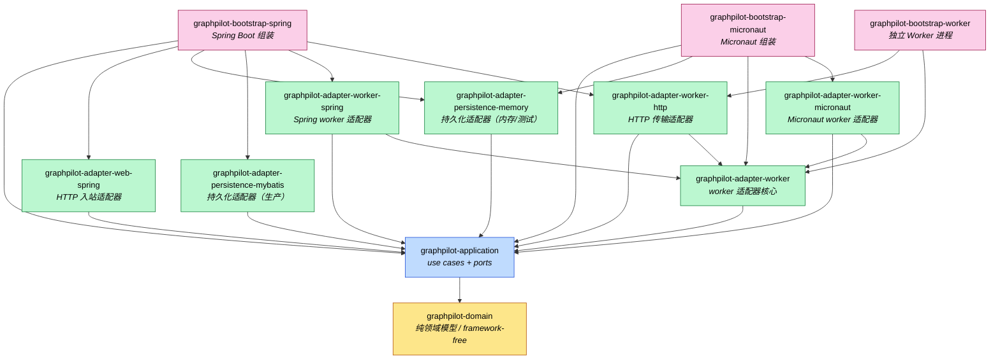

# GraphPilot 模块依赖图

本文档描述 GraphPilot 后端 Maven 多模块之间的依赖关系。后端采用 Hexagonal Architecture（Ports and Adapters），依赖方向严格向内：

```text
bootstrap -> adapters -> application -> domain
```

> 图中箭头方向 `A --> B` 表示 **A 依赖 B**。

## 模块依赖图



## 依赖矩阵

| 模块 | 依赖的内部模块 |
|------|----------------|
| `graphpilot-domain` | （无） |
| `graphpilot-application` | `graphpilot-domain` |
| `graphpilot-adapter-web-spring` | `graphpilot-application` |
| `graphpilot-adapter-persistence-mybatis` | `graphpilot-application` |
| `graphpilot-adapter-persistence-memory` | `graphpilot-application` |
| `graphpilot-adapter-worker` | `graphpilot-application` |
| `graphpilot-adapter-worker-spring` | `graphpilot-application`、`graphpilot-adapter-worker` |
| `graphpilot-adapter-worker-micronaut` | `graphpilot-application`、`graphpilot-adapter-worker` |
| `graphpilot-adapter-worker-http` | `graphpilot-application`、`graphpilot-adapter-worker` |
| `graphpilot-bootstrap-spring` | `graphpilot-application`、`graphpilot-adapter-web-spring`、`graphpilot-adapter-persistence-memory`、`graphpilot-adapter-persistence-mybatis`、`graphpilot-adapter-worker-spring`、`graphpilot-adapter-worker-http` |
| `graphpilot-bootstrap-micronaut` | `graphpilot-application`、`graphpilot-adapter-persistence-memory`、`graphpilot-adapter-worker`、`graphpilot-adapter-worker-micronaut` |
| `graphpilot-bootstrap-worker` | `graphpilot-adapter-worker-http`、`graphpilot-adapter-worker` |

## 新增模块说明

### graphpilot-adapter-worker-http

HTTP 传输适配器，提供 scheduler ↔ worker 进程间任务调用的 HTTP 通道：

- **scheduler 侧**：`HttpRemoteTaskHandlerProvider` + `HttpRemoteTaskHandler` 实现 `TaskHandlerProvider` 接口，通过 HTTP POST 将 task 分发到 worker 进程
- **worker 侧**：`WorkerTaskController` 暴露 `POST /api/worker/execute` 端点，接收调度侧请求并调用本地 handler

### graphpilot-bootstrap-worker

独立 Worker 进程 bootstrap，装配：

- `WorkerApplication`（Spring Boot main class，端口 8081）
- `TaskHandlerRegistry`（shell/mock handlers）
- `WorkerTaskController`（HTTP 端点）

**调度模式**：

- `local`（默认）：handler 在 scheduler 进程内执行
- `remote`：handler 在独立 worker 进程执行，通过 HTTP 分发

## 要点

- **依赖方向严格向内**：`bootstrap -> adapter -> application -> domain`，符合 Hexagonal Architecture 规则。`graphpilot-domain` 不依赖任何内部模块，保持 framework-free。
- **两套对称的运行时组装**：`graphpilot-bootstrap-spring` 与 `graphpilot-bootstrap-micronaut` 各自挑选一组 adapter 装配出可运行实例，两者都包含 `graphpilot-application`，但选择的 persistence/worker adapter 不同。
- **worker 适配器分两层**：`graphpilot-adapter-worker` 是框架无关的核心，`graphpilot-adapter-worker-spring` / `graphpilot-adapter-worker-micronaut` 是各自的框架绑定，二者都依赖核心 `graphpilot-adapter-worker`（详见 ADR 0004）。
- **HTTP 传输适配器**：`graphpilot-adapter-worker-http` 同时被 scheduler bootstrap（用于分发任务）和 worker bootstrap（用于接收任务）依赖，实现双向通信。
- **persistence-memory 是共用测试替身**：两个 bootstrap 都引用它。生产持久化走 `graphpilot-adapter-persistence-mybatis`（仅 Spring bootstrap 使用）。

## 相关文档

- [架构概览](./overview.md)
- [ADR 0003 Hexagonal Architecture](./adr/0003-hexagonal-architecture.md)
- [ADR 0004 Framework-free Worker Core](./adr/0004-framework-free-worker-core.md)
- [独立 Worker 进程设计](../superpowers/specs/2026-06-21-standalone-worker-design.md)