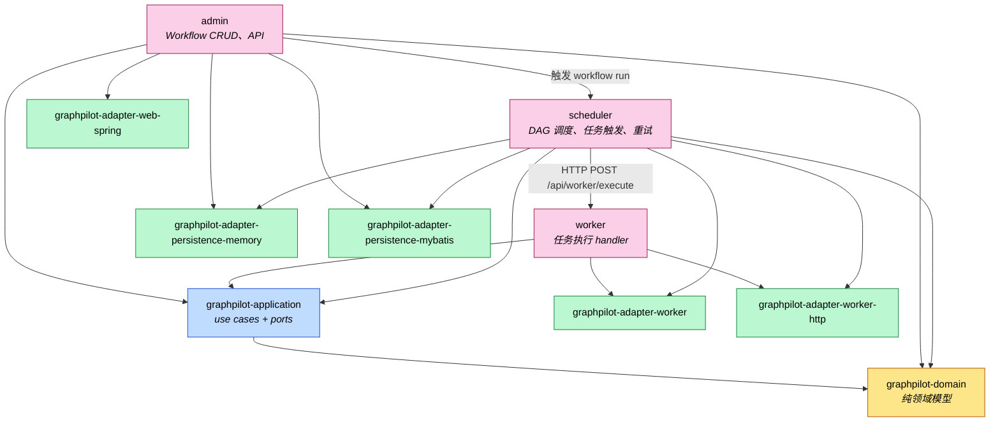

# GraphPilot 模块依赖图

本文档描述 GraphPilot 后端 Maven 多模块之间的依赖关系。后端采用 **3 核心业务模块** 架构：

```text
admin (管理) → scheduler (调度) → worker (执行)
```

> 图中箭头方向 `A --> B` 表示 **A 依赖 B**。

## 模块依赖图



## 模块清单（11 个）

| 模块 | 说明 |
|------|------|
| **scheduler** | 调度核心（端口 8080）：DAG 调度、任务触发、重试 |
| **worker** | 任务执行（端口 8081）：shell/mock handlers |
| **admin** | 管理 API（端口 8082）：Workflow CRUD、前端接口 |
| graphpilot-domain | 共享领域模型 |
| graphpilot-application | 共享应用层（use cases + ports） |
| graphpilot-adapter-persistence-memory | 内存持久化（测试用） |
| graphpilot-adapter-persistence-mybatis | MyBatis 持久化（生产用） |
| graphpilot-adapter-worker | Worker 核心（shell/mock handler） |
| graphpilot-adapter-worker-http | Worker HTTP 传输 |
| graphpilot-adapter-web-spring | Spring Web 适配器 |

## 依赖矩阵

每个核心模块自包含其所需的 adapter：

| 模块 | 直接依赖 |
|------|----------|
| **scheduler** | `application`, `domain`, `adapter-persistence-*`, `adapter-worker`, `adapter-worker-http` |
| **worker** | `application`, `adapter-worker`, `adapter-worker-http` |
| **admin** | `application`, `domain`, `adapter-persistence-*`, `adapter-web-spring` |

## 进程间通信

```
┌─────────────┐     POST /api/worker/execute     ┌─────────────┐
│  scheduler  │ ──────────────────────────────────→│   worker    │
│   (8080)    │                                   │   (8081)    │
└─────────────┘                                   └─────────────┘
       ↑
       │ 创建 WorkflowRun
       │
┌─────────────┐
│   admin     │
│   (8082)    │
└─────────────┘
```

- **admin → scheduler**：创建 WorkflowRun（触发调度）
- **scheduler → worker**：HTTP POST 分发任务执行（remote 模式）

## 配置

### scheduler (application.yml)

```yaml
server:
  port: 8080
graphpilot:
  scheduler:
    scanner:
      enabled: true
      interval-ms: 10000
  worker:
    dispatch:
      mode: local  # local 或 remote
```

### worker (application.yml)

```yaml
server:
  port: 8081
graphpilot:
  worker:
    handlers: [shell, mock]
```

### admin (application.yml)

```yaml
server:
  port: 8082
graphpilot:
  persistence:
    type: memory  # memory 或 mybatis
```

## 相关文档

- [架构概览](./overview.md)
- [独立 Worker 进程设计](../superpowers/specs/2026-06-21-standalone-worker-design.md)